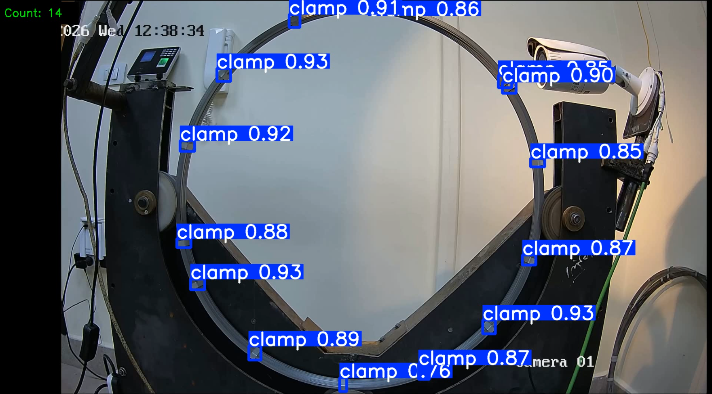
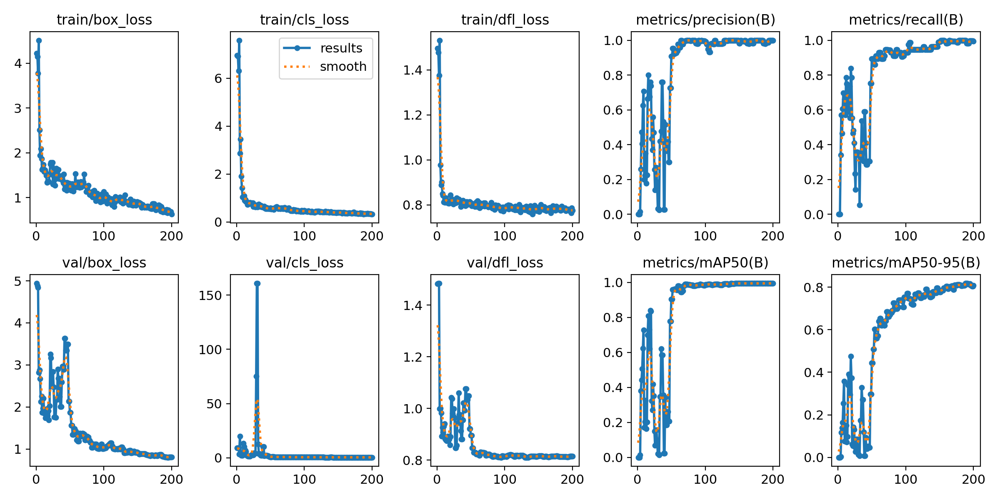
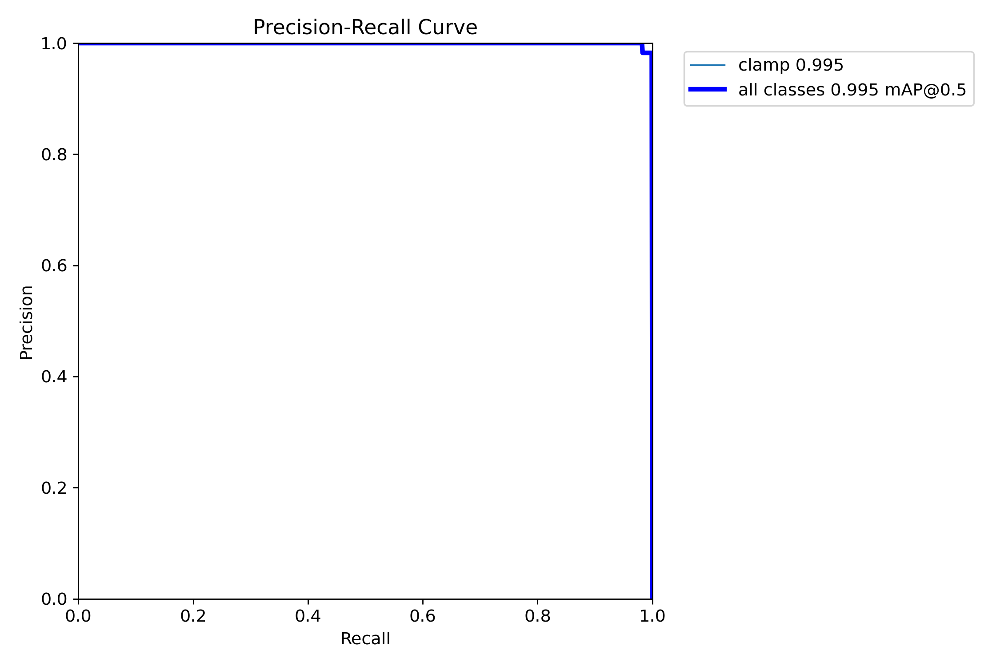
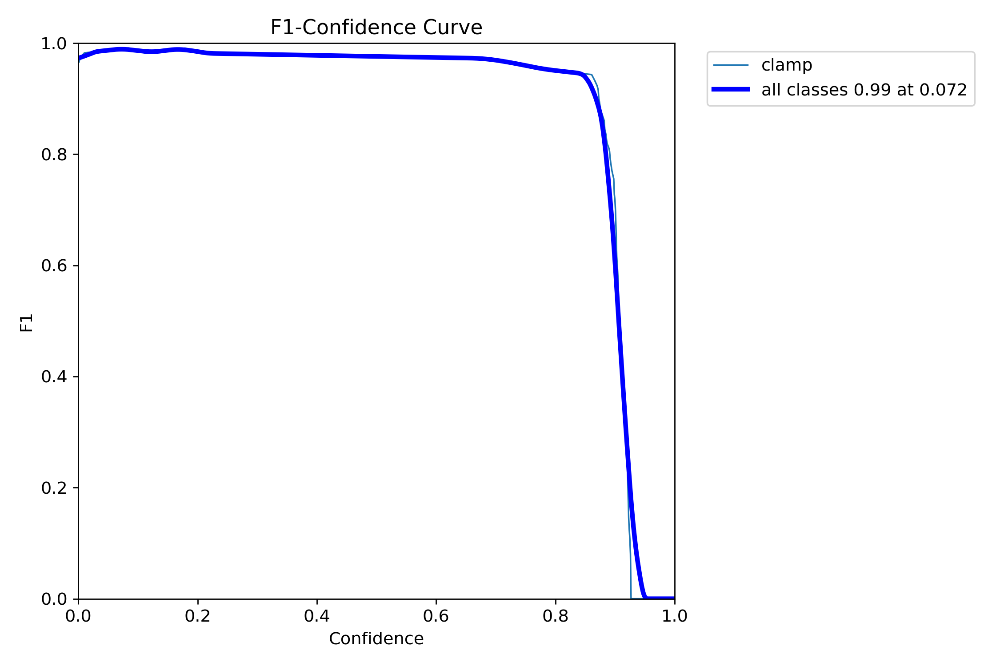
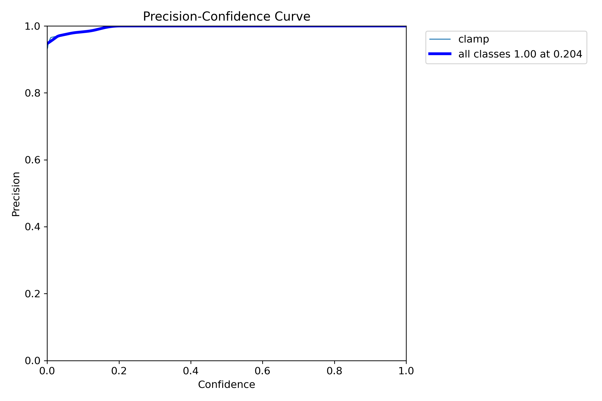
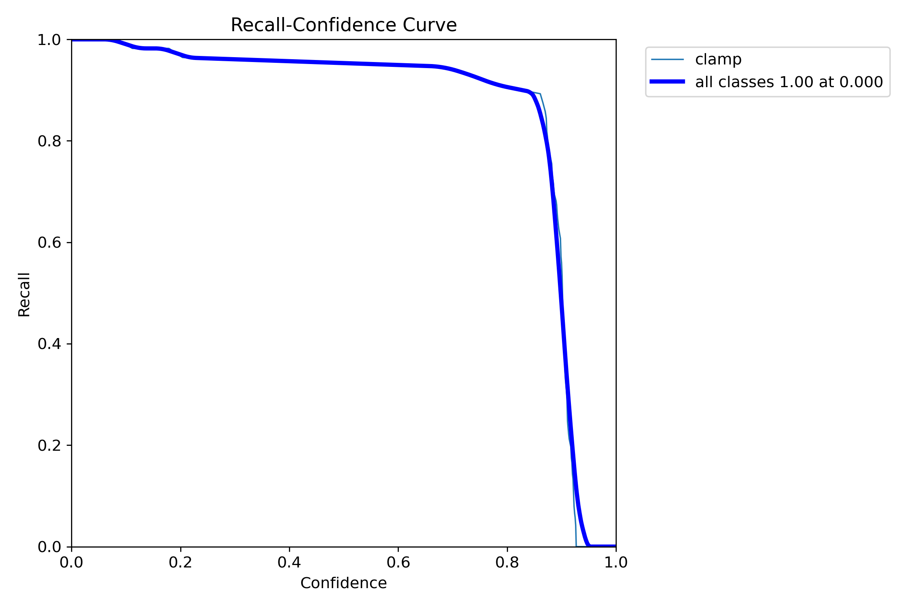
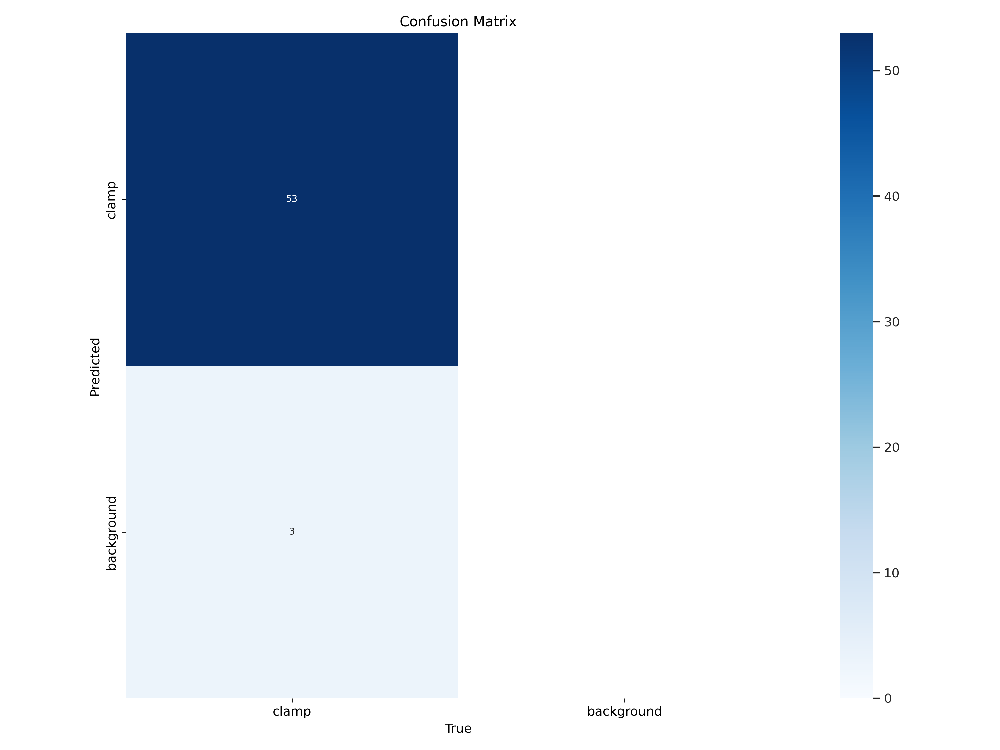
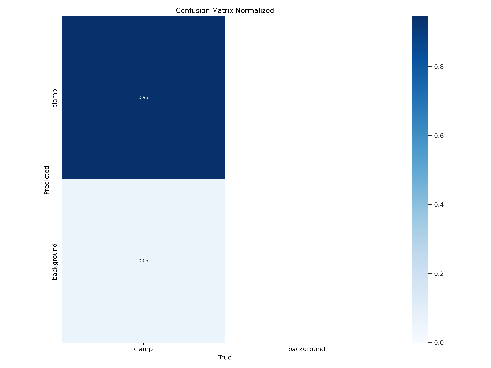
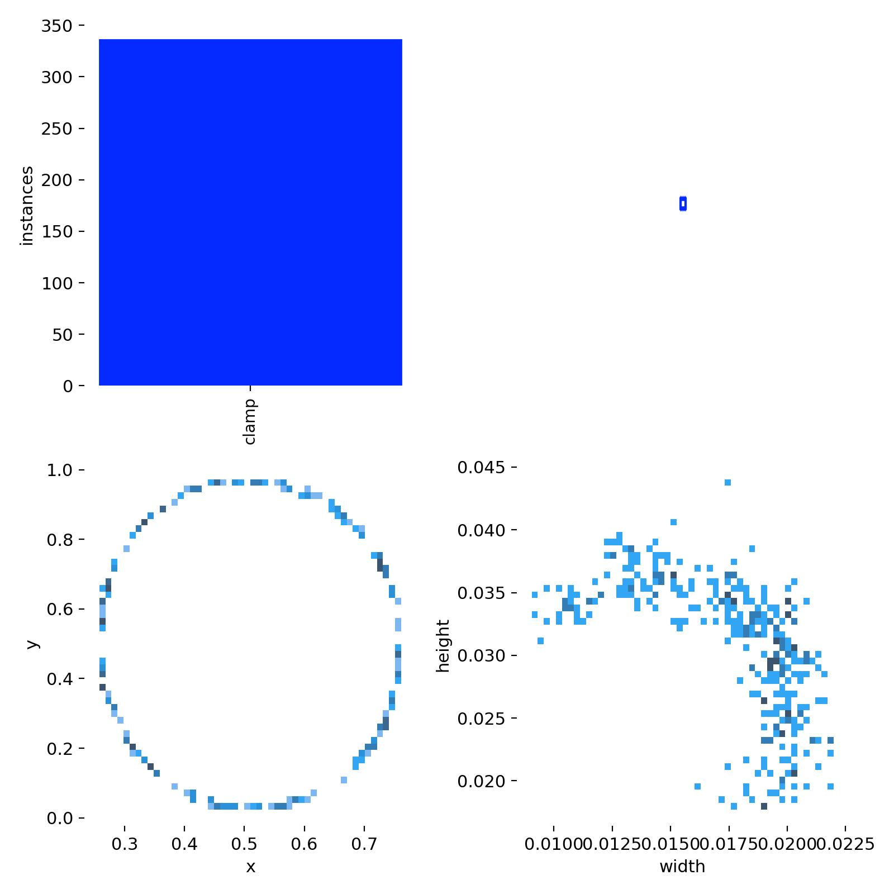

<div align="center">

<br/>

# 🔩 Clamp Detection

**End-to-end object detection pipeline for industrial clamp counting in video**

*Built with Ultralytics YOLO11 · ElectroPi AI Internship Task*

<br/>

[](https://docs.ultralytics.com/)
[](#training)
[](#results)
[](#)

</div>

<div align="center">



</div>

---

## Dataset & video preparation

For labeling and training, **video was converted into individual frames** using a custom script. The pipeline **scores every frame for sharpness** (Laplacian variance) and **keeps only the best 30 frames**—the clearest stills—for review or annotation. That script lives at [`scripts/convert_video_to_frames.py`](scripts/convert_video_to_frames.py); run it on `video/Task.mp4` (or change the path inside the script) to regenerate `frames/`.

The **YOLO-format clamp dataset** used for this project is hosted on Roboflow Universe. You can browse versions, splits, and export options here:

**[Clamp Detection on Roboflow Universe](https://universe.roboflow.com/faculty-of-engineering-alex-uni/clamp-detection-a7iao)**

---

## Overview

This project implements a full **clamp detection and counting pipeline** — from raw video to annotated output — using [Ultralytics YOLO11](https://docs.ultralytics.com/). It covers dataset preparation, model training, and robust video inference with **temporally stabilized** clamp counts.

The core challenge: raw per-frame YOLO detections are noisy. Adjacent or overlapping clamps can be split or merged across consecutive frames, causing the count to flicker even when the scene is static. This project solves that with a **rolling-window majority vote** that gives stable, reliable counts suitable for reporting or downstream logic.

---

## Repository Structure

Current layout (matches the repository root):

```
.
├── README.md
├── Dataset/                        # YOLO-format dataset (train / valid / test)
│   ├── train/
│   │   ├── images/
│   │   └── labels/
│   ├── valid/
│   │   ├── images/
│   │   └── labels/
│   └── test/
│       ├── images/
│       └── labels/
├── video/
│   └── Task.mp4                    # Source video for frame extraction & inference
├── frames/                         # Top 30 sharpest frames (from Laplacian scoring)
├── scripts/
│   └── convert_video_to_frames.py  # Ranks frames by sharpness; exports best 30
├── model/
│   └── best.pt                     # Deployed checkpoint for inference
├── training results/               # Ultralytics run: metrics, plots, TensorBoard, weights
│   ├── args.yaml
│   ├── results.csv
│   ├── results.png                 # (+ other curves, confusion matrices, batch previews)
│   └── weights/
│       ├── best.pt
│       └── last.pt
├── docs/
│   └── images/                     # README banner + training / eval plots
│       ├── Title.png
│       ├── results.png
│       ├── PR_curve.png
│       ├── F1_curve.png
│       ├── P_curve.png
│       ├── R_curve.png
│       ├── confusion_matrix.png
│       ├── confusion_matrix_normalized.png
│       └── labels.jpg
├── inference/
│   └── inference.py                # Video inference + temporal count stabilization
├── Output/
    └── output.mp4                  # Annotated inference output (after you run inference)
```

---

## Training

The model was trained using **Ultralytics YOLO11m** on a custom annotated clamp dataset.

| Parameter     | Value             |
|---------------|-------------------|
| Base model    | `yolo11m.pt`      |
| Epochs        | 200               |
| Image size    | 640 × 640         |
| Batch size    | 16                |
| Task          | Object detection  |
| Dataset split | 80 / 15 / 5 %     |

Full configuration in `training results/args.yaml`. Per-epoch history in `training results/results.csv`.

---

## Results

Validation metrics at epoch 200 (from the last row of `results.csv`):

| Metric         | Value  |
|----------------|--------|
| Precision (B)  | 1.000  |
| Recall (B)     | 0.995  |
| mAP@0.5        | 0.995  |
| mAP@0.5:0.95   | 0.808  |

> **Note:** Strong validation metrics on a small split should always be interpreted alongside qualitative checks on held-out video and real deployment conditions.

## 🎥 Demo Video


### Training Curves

Plots below are stored under **`docs/images/`** (space-free paths) so they render reliably on GitHub and in the IDE. They match the originals in `training results/`.

**Training / validation summary (200 epochs)**



**Precision–recall and F1**





**Precision and recall vs. confidence**





**Confusion matrices**





**Label distribution**



| Plot | In-repo path |
|------|----------------|
| Training / validation summary | [`docs/images/results.png`](docs/images/results.png) |
| Precision–Recall curve | [`docs/images/PR_curve.png`](docs/images/PR_curve.png) |
| F1 curve | [`docs/images/F1_curve.png`](docs/images/F1_curve.png) |
| Precision vs. confidence | [`docs/images/P_curve.png`](docs/images/P_curve.png) |
| Recall vs. confidence | [`docs/images/R_curve.png`](docs/images/R_curve.png) |
| Confusion matrix | [`docs/images/confusion_matrix.png`](docs/images/confusion_matrix.png) |
| Confusion matrix (normalized) | [`docs/images/confusion_matrix_normalized.png`](docs/images/confusion_matrix_normalized.png) |
| Label distribution | [`docs/images/labels.jpg`](docs/images/labels.jpg) |

---

## Running Inference

### Prerequisites

```bash
pip install ultralytics opencv-python tqdm
```

### Steps

1. **Prepare the model** — ensure `model/best.pt` exists, or symlink it:
   ```bash
   ln -s "training results/weights/best.pt" model/best.pt
   ```

2. **Set the video path** — open `inference/inference.py` and update `video_path` to point to your input video:
   ```python
   video_path = "video/Task.mp4"
   ```

3. **Run inference**:
   ```bash
   python inference/inference.py
   ```

4. **Find the output** — the annotated video is written to `Output/output.mp4`.

---

## Problem I Faced : Flickering Counts

When counting clamps directly from raw YOLO detections on a per-frame basis, the result is **unstable**:

- Overlapping or adjacent clamps are sometimes detected as one box, sometimes as two
- The bounding box count fluctuates frame-to-frame even when the scene hasn't changed
- A simple `"count boxes on this frame"` approach is unreliable for video

---

## The Solution: Temporal Stabilization

Rather than trusting any single frame, detections are smoothed over a **rolling history window** using **majority voting**.

```python
from collections import Counter, deque

history = deque(maxlen=20)          # rolling window of last 20 frames

# inside the frame loop:
raw_count = len(results[0].boxes)
history.append(raw_count)
stable_count = Counter(history).most_common(1)[0][0]  # mode of window
```

This suppresses brief splits and merges while still allowing the count to adapt when the scene genuinely changes. Combined with tuned `conf` and `iou` thresholds on `model.predict(...)`, spurious and duplicate boxes are reduced before counting even begins.

---

## Acknowledgment

Completed as part of the **ElectroPi AI Internship** program.
Custom dataset annotation, 200-epoch YOLO11m training, and temporally stabilized video inference for robust clamp counting.
